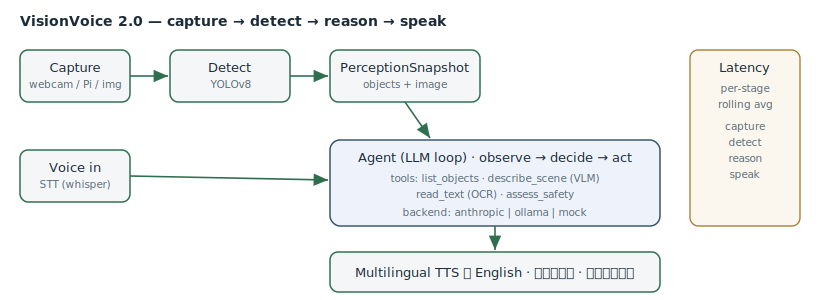

# VisionVoice 2.0 — Real-Time Multimodal Voice Agent for Accessibility

> A real-time assistant that **sees** through a camera, **understands** the scene with a
> vision-language model, **reasons** with an LLM agent (tool use), and **speaks** back in
> multiple languages (English, Tamil, Malayalam). Runs on a laptop today, structured to
> deploy to a Raspberry Pi 5.

<p align="center">
  
</p>

<p align="center">
  <a href="#"></a>
  <a href="#"></a>
  <a href="#"></a>
  
</p>

---

## What it does

VisionVoice turns a live camera feed into a spoken, conversational assistant for
blind and low-vision users:

1. **Capture** — grabs frames from a webcam (or a Raspberry Pi camera).
2. **Detect** — runs **YOLOv8** object detection and localizes objects (left / center / right, near / far).
3. **Understand** — a **vision-language model** describes the scene in natural language.
4. **Reason (Agent)** — an **LLM agent** answers spoken questions using *tools*:
   `list_objects`, `describe_scene`, `read_text` (OCR), and `assess_safety`. It decides
   which tools to call — this is what makes it an *agent*, not a chatbot.
5. **Speak** — replies are spoken back with **multilingual TTS** (English, தமிழ், മലയാളം).

You can ask things like:

- *"What's in front of me?"*
- *"Is it safe to cross?"*
- *"Read this sign."*
- *"How many people are in the room?"*

## Why this design

The model "brain" is **swappable** via config — the exact same agent runs on either backend:

| Backend | LLM / reasoning | Vision (VLM) | Cost | Offline | Best for |
|---|---|---|---|---|---|
| `anthropic` | Claude API | Claude vision | 💲 | ❌ | Best quality, demos |
| `ollama` | local (e.g. llama) | local (e.g. llava) | Free | ✅ | Pi / privacy / offline |
| `mock` | deterministic stub | template | Free | ✅ | Tests / CI / no setup |

This means the repo **installs and runs its tests with zero API keys, no GPU, and no
camera** (using the `mock` backend), while still supporting a full cloud or fully-local
deployment. That is deliberately how production ML systems are built.

## Quickstart

```bash
# 1. Clone + install (editable)
git clone https://github.com/OWNER/visionvoice.git
cd visionvoice
py -m venv .venv && .venv\Scripts\activate      # Windows
# python3 -m venv .venv && source .venv/bin/activate   # macOS/Linux
pip install -e .

# 2. Run the offline demo — no camera, no keys, no GPU needed
visionvoice demo

# 3. Ask a question about a still image (mock backend)
visionvoice ask --image samples/street.jpg "what's in front of me?"
```

### Turn on the real brain

```bash
cp .env.example .env
# edit .env → set VV_PROVIDER=anthropic and VV_ANTHROPIC_API_KEY=sk-ant-...
# (or VV_PROVIDER=ollama with Ollama running locally)

visionvoice live            # live webcam + voice, full pipeline
```

Install the optional heavy extras only when you want live vision/voice:

```bash
pip install -e ".[vision]"   # ultralytics (YOLOv8), opencv, pytesseract
pip install -e ".[voice]"    # gTTS / pyttsx3 / speech recognition
pip install -e ".[all]"      # everything
```

## CLI

```
visionvoice demo                       # offline scripted demo (mock backend)
visionvoice ask   --image PATH "..."   # one-shot Q&A about an image
visionvoice describe --image PATH      # one-shot scene description
visionvoice live                       # live camera + voice loop
visionvoice serve                      # FastAPI web demo at http://localhost:8000
visionvoice info                       # show resolved config + backend health
```

## Web demo (deployment checkbox)

```bash
pip install -e ".[web]"
visionvoice serve
# open http://localhost:8000 → upload an image, ask a question, get an answer
```

## Architecture

See [docs/architecture.md](docs/architecture.md). The pipeline is a clean multi-stage
flow with a pluggable provider layer:

```
camera ─▶ capture ─▶ detect (YOLOv8) ─▶ perception context
                                              │
                          voice/text query ──▶ agent (LLM + tools) ─▶ answer ─▶ TTS
                                              │        └── tools: list_objects,
                                              │            describe_scene (VLM),
                                              │            read_text (OCR), assess_safety
```

## Latency

The pipeline records per-stage timings (capture → detect → reason → speak) and prints a
rolling average; on a laptop with the local YOLOv8-n model the detect stage runs in the
~30–60 ms range. Use `visionvoice live --show-latency` to overlay timings.

## Testing

```bash
pip install -e ".[dev]"
pytest -q            # runs entirely on the mock backend — no keys/GPU/camera
ruff check .
```

## Roadmap

- [ ] Depth estimation (MiDaS) for real distance-to-object
- [ ] Wake-word ("Hey Vision") for hands-free activation
- [ ] On-device quantized VLM for full-offline Pi deployment
- [ ] Haptic/vibration output channel

## License

MIT — see [LICENSE](LICENSE).
